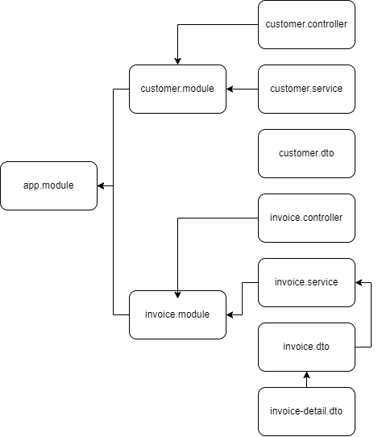

# Reto final del tercer pathway de NestJS
### por Edinson Acosta Gancharov

### Video Explicativo: *https://youtu.be/nKTjkwcLYv4*

## Descripcion
El presente trabajo consiste en la continuacion de la App Demo creada en la fase 2, aplicando el manejo del ciclo de vida de las Solicitudes/Respuestas. El proyecto con sus respectivos controladores, modulos y servicios esta basado en el siguiente esquema:

Existe una entidad `Customer` que permite la crear, manipular, buscar y borrar la informacion de los clientes, y por otro lado se tiene una entidad `Invoice`, que maneja todo lo referente a las facturas y su informacion. 

Dentro de cada `invoice` se agregan los detalles correspondientes a las ventas, y cada factura esta asociada a un unico `Customer`.

## Acceder al proyecto
Para probar esta solucion se puede clonar este repositorio desde su IDE de preferencia o bien descargarlo en formato `.ZIP`, luego descomprimirlo y posteriormente asociarlo al IDE que prefiera.
Se recomienda usar Visual Studio Code.

## Iniciar el servicio
Una vez clonado o descargado el proyecto se puede ejecutar utilizando el comando `npm run start` desde la consola del IDE o del sistema.

## Pruebas
El test de funcionamiento del API se realiza mediante consumo de API a traves de POSTMAN, Thunder CLient, o cualquier otra API que permita realizar peticiones http.
Se adjunta en la carpeta `Assets`un archivo JSON con la configuracion de las peticiones HTTP para ser evaluadas en POSTMAN. Ese archivo debe ser importado desde la API para poder ser ejecutados los tests.

Para evaluar si el servicio esta funcionando puede, por ejemplo, ingresar a http://localhost:3000/ y vera que recibe en pantalla el texto *"Solucion al reto final del tercer path de NestJS!"*
